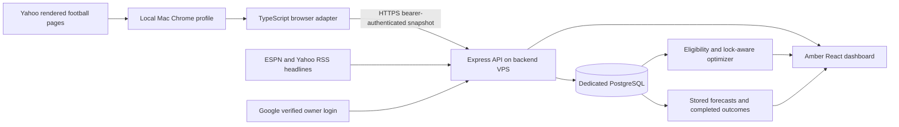

# Architecture

## Boundaries

The browser adapter is the only component that understands Yahoo page structure. `Snapshot` version 1 contains provider, capture time, season/week, league/team identity, players, a player pool and optional source-page sections. Alternative integrations should produce the same contract; the UI and optimizer consume normalized fields. Raw sections are retained for owner inspection and troubleshooting, not exposed publicly.

Player fields include provider ID, name, NFL team, positions, current slot, bye, injury status, kickoff timestamp, started/completed flags, projected/actual points, roster/start percentages and stats. A missing value stays null. The player-pool projection filter is recorded so forecast values never become actual results. Provider player IDs must be mapped explicitly before blending across sources.

The public response is an explicit allowlist. It contains the owner's team name and player analysis, anonymized opponent summary statistics, linked public headlines and sanitized availability. It excludes league identity, raw page content, participant names, owner events, session data and import credentials. Owner authorization requires a Google ID token with the expected issuer, audience, nonce, verified email and exact allowed email.

## Persistence

- `snapshots`: validated JSONB snapshots, capture time, unique SHA-256 digest; duplicate submissions are idempotent.
- `forecasts`: records created at import time for unlocked players plus the advisory lineup.
- `sessions`: expiring server-side OAuth state and owner sessions; browser receives an HttpOnly SameSite cookie.
- `events`: import results and operational status.

The last valid snapshot remains available on failed imports. Latest history is scoped to the same league, team and season. Forecast evaluation uses the earliest stored unlocked forecast and the latest completed-game outcome; in-progress actuals cannot qualify as final results. Stat corrections can revise the latest outcome.

## Frontend

React, TypeScript and Recharts; charcoal backgrounds, amber highlights, responsive tables, player drawers, reduced-motion support. Charts represent actual stored values; no invented time series or retrospective model performance is shown.

Owner-only, same-origin `POST /api/import/request` writes a singleton durable refresh request in PostgreSQL. Authenticated worker `GET /api/import/request` reports whether work is pending; owner sessions can also read it. Successful snapshot ingestion fulfills requests at or before the snapshot capture timestamp in the same transaction. Import failures and cooldowns preserve pending requests. No inbound connection to the Mac is required. Scheduled checks now run every 60 seconds, retaining import cadence throttling for non-requested work.

`GET /api/depth` serves cached public ESPN NFL depth charts. Four concurrent fetch workers cover the 32 teams, using bounded timeouts. Missing teams/athletes remain unknown. This enrichment is independent of the snapshot provider and does not put Yahoo credentials on the VPS.

`POST /api/import/heartbeat` accepts the existing worker bearer token and stores bounded status text and cooldown metadata in `worker_health`. Progress status posts also update worker health and persist operation events. Owner-only `GET /api/import/operations` returns worker health, the refresh request, and the latest 150 logs. Raw browser contents, credentials and cookies are never included in operation logs.

## Player intelligence and Qwen

Each newly observed snapshot queues a persistent `intelligence` job. The VPS fetches current/prior-year nflverse weekly player statistics and snap counts plus schedules, cached in PostgreSQL for 24 hours; Yahoo browsing remains capped at two available W/R/T pages. ESPN depth order and cached RSS headlines enrich the evidence. Prior-season usage is explicitly historical, and same/future-week rows are excluded from model features.

The experimental points model retains Yahoo until at least three current-season games are available. Thereafter it blends 75% Yahoo and 25% recent league-scored points, with a matchup factor clamped to 0.9–1.1 when opponent samples suffice. It is a transparent heuristic, not a trained or proven superior model. The existing eligibility/game-lock optimizer builds a suggested lineup from these projections. League scoring settings determine historical point conversion; missing inputs remain visible.

A separate Mac launch agent, `com.ramideltoro.fantasy-football-edge.ai`, checks for analysis jobs every minute, using the existing import bearer token. It connects to localserver.ramideltoro.com over authenticated SSH/Cloudflare Access and calls the local Ollama Qwen2.5 3B model. It does not change the existing NutsNews review/translation API or perform Yahoo browsing. Qwen returns bounded JSON commentary; the server validates schema and player IDs. Model scores remain deterministic and separate from generated explanations. Secrets and SSH identities stay private on the Mac.

The AI insights section shows forecasts, historical scoring/targets/carries/snap charts, injury flags, opponent, depth role, matching news, Qwen actions with uncertainty, source status and timestamps. Accuracy compares earliest pre-kickoff stored numerical forecasts against later completed imported results, alongside the same Yahoo baseline. Samples and mean absolute error are shown; missing outcomes and unmeasured improvement are not invented. Qwen prose is not numerically scored.

Qwen output is evidence-constrained: it chooses supplied player IDs, actions and evidence keys. The server builds displayed explanations from canonical source facts, rejects unsupported evidence keys, removes duplicate IDs, and downgrades invalid start/waiver actions. Free-form model assertions are not published. This guard was added after a live response introduced unsupported red-zone/YAC claims; that response was withdrawn and regenerated under the stricter contract.
