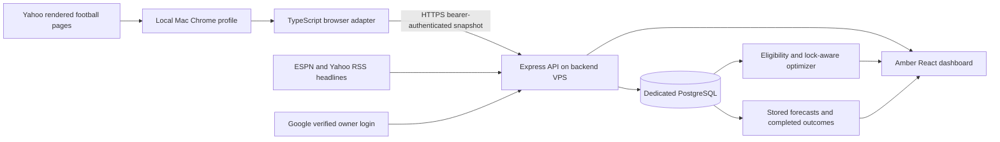

# Architecture

## Boundaries

The browser adapter is the only component that understands Yahoo page structure. `Snapshot` version 1 contains provider, capture time, season/week, league/team identity, players, a player pool and optional source-page sections. Alternative integrations should produce the same contract; the UI and optimizer consume normalized fields. Raw sections are retained for owner inspection and troubleshooting, not exposed publicly.

Player fields include provider ID, name, NFL team, positions, current slot, bye, injury status, kickoff timestamp, started/completed flags, projected/actual points, roster/start percentages and stats. A missing value stays null. The player-pool projection filter is recorded so forecast values never become actual results. Provider player IDs must be mapped explicitly before blending across sources.

The public response is an explicit allowlist. It contains the owner's team name and player analysis, anonymized opponent summary statistics, linked public headlines and sanitized availability. It excludes league identity, raw page content, participant names, owner events, session data and import credentials. Owner authorization requires a Google ID token with the expected issuer, audience, nonce, verified email and exact allowed email.

## Persistence

- `snapshots`: validated JSONB snapshots, capture time, unique SHA-256 digest; duplicate submissions are idempotent.
- `forecasts`: records created at import time for unlocked players plus the advisory lineup.
- `sessions`: expiring server-side OAuth state and owner sessions; browser receives an HttpOnly SameSite cookie.
- `events`: import results and operational status.

The last valid snapshot remains available on failed imports. Latest history is scoped to the same league, team and season. Forecast evaluation uses the earliest stored unlocked forecast and the latest completed-game outcome; in-progress actuals cannot qualify as final results. Stat corrections can revise the latest outcome.

## Frontend

React, TypeScript and Recharts; charcoal backgrounds, amber highlights, responsive tables, player drawers, reduced-motion support. Charts represent actual stored values; no invented time series or retrospective model performance is shown.

Owner-only, same-origin `POST /api/import/request` writes a singleton durable refresh request in PostgreSQL. Authenticated worker `GET /api/import/request` reports whether work is pending; owner sessions can also read it. Successful snapshot ingestion fulfills requests at or before the snapshot capture timestamp in the same transaction. Import failures and cooldowns preserve pending requests. No inbound connection to the Mac is required. Scheduled checks now run every 60 seconds, retaining import cadence throttling for non-requested work.

`GET /api/depth` serves cached public ESPN NFL depth charts. Four concurrent fetch workers cover the 32 teams, using bounded timeouts. Missing teams/athletes remain unknown. This enrichment is independent of the snapshot provider and does not put Yahoo credentials on the VPS.
